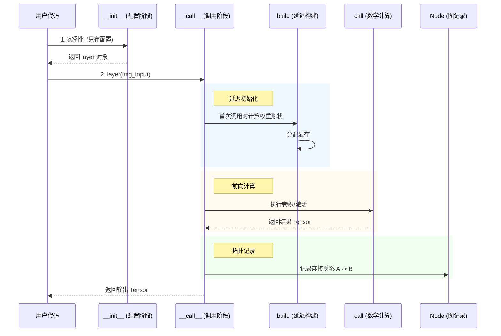

# VGG16 与深度学习核心概念学习笔记

本文档整理了关于 VGG16 网络结构、Keras 框架机制以及深度学习核心概念的对话精华。

---

## 1. Keras 框架机制：函数式 API 的奥秘

### 问题
代码 `x = layers.Conv2D(64, (3, 3), ...)(img_input)` 中的 `(img_input)` 到底调用了哪个类的哪个方法？为什么要这么写？

### 解析
*   **直接调用**: 调用的是基类 `keras.layers.Layer` 中的 `__call__` 方法。
*   **实际执行**: `__call__` 内部会调用子类（如 `BaseConv`）的 `call` 方法来执行具体的数学运算。

### 核心机制
这种写法是为了解决深度学习模型构建中的两个核心痛点：

1.  **延迟初始化 (Lazy Initialization)**:
    *   在实例化 `Conv2D(64, ...)` 时，Keras 并不知道输入图片的通道数，因此无法创建权重矩阵。
    *   只有当 `(img_input)` 传入时，Keras 才能推断出输入形状，从而在 `build()` 方法中动态创建权重（显存分配）。
2.  **图构建 (Graph Construction)**:
    *   Keras 利用这一步记录张量之间的连接关系（Node），将孤立的层串联成有向无环图（DAG），从而支持模型的保存、可视化和训练。

---

## 2. 卷积与池化：参数详解

### 卷积层 (Conv2D)
`layers.Conv2D(64, (3, 3), padding="same")`

*   **`kernel_size=(3, 3)`**: **视力范围**。相当于一个 3x3 的放大镜，在图片上滑动，每次只关注局部 9 个像素的特征。
*   **`filters=64`**: **特征数量**。相当于用 64 个不同的放大镜去看同一张图，提取出 64 种不同的特征（如横线、竖线、红斑等）。
*   **`padding="same"`**: **保持尺寸**。在图片周围补零，使得卷积后的输出长宽与输入一致（224x224 -> 224x224）。如果没有这个，图片会变小。

### 池化层 (MaxPooling2D)
`layers.MaxPooling2D((2, 2), strides=(2, 2))`

*   **`pool_size=(2, 2)`**: **筛选窗口**。将图片切分成 2x2 的小块。
*   **`strides=(2, 2)`**: **步长**。窗口每次移动 2 格，意味着窗口之间**无重叠**。
*   **作用**: **下采样 (Downsampling)**。在每个 2x2 区域中只保留最大的那个值（最显著的特征）。这导致图片长宽减半（224 -> 112），大大减少了计算量，并提供了平移不变性。

---

## 3. VGG16 的结构演变：从边缘到语义

VGG16 通过 5 个 Block 将图片从“像素”转化为“概念”。

| Block | 操作 | 尺寸变化 | 深度变化 | 提取特征含义 |
| :--- | :--- | :--- | :--- | :--- |
| **Input** | - | 224 x 224 | 3 (RGB) | 原始像素 |
| **Block 1** | 2 Conv + Pool | 224 -> 112 | 3 -> 64 | **边缘、纹理** (极细微细节) |
| **Block 2** | 2 Conv + Pool | 112 -> 56 | 64 -> 128 | **简单形状** (圆、方、条纹) |
| **Block 3** | 3 Conv + Pool | 56 -> 28 | 128 -> 256 | **物体部件** (眼睛、轮子) |
| **Block 4** | 3 Conv + Pool | 28 -> 14 | 256 -> 512 | **完整物体** (猫头、车身) |
| **Block 5** | 3 Conv + Pool | 14 -> 7 | 512 -> 512 | **高度语义** (概念、类别) |

---

## 4. 核心概念辨析

### Q: 输出 `(7, 7, 512)` 是什么意思？
这意味着我们将原始图片切分成了 **7x7 = 49 个区域**。
*   **7x7 (Where)**: 空间位置信息。虽然模糊，但仍能区分左上角还是右下角。
*   **512 (What)**: 特征维度。对于这 49 个区域中的每一个，网络都用 512 个数值来详细描述该区域的内容（语义向量）。

### Q: 只有 512 维，能区分 1 万种分类吗？
**完全没问题。**
*   **误区**: 512 维 = 512 种分类。
*   **真相**: 512 维 = 512 种**属性**。
    *   就像用“性别、身高、体重...”等 512 个属性来描述人，其组合空间是天文数字 ($2^{512}$)。
    *   Milvus 等向量数据库通过计算高维空间中的**距离**来区分不同物体，而不是靠“桶”的数量。

### Q: 64个 Filters x 3x3 窗口扫描，计算量不会爆炸吗？
**不会，因为有 Im2Col + GEMM 优化。**
*   计算机不会傻傻地写 4 重循环去滑动窗口。
*   **Im2Col**: 将输入图片的所有 3x3 局部块“拉直”成一个巨大的矩阵 $X$。
*   **Weights**: 将 64 个卷积核“拉直”成另一个矩阵 $W$。
*   **GEMM**: 执行一次矩阵乘法 $W \times X$，利用 GPU 的并行能力瞬间算出所有结果。

### Q: 这 64 个 Filters 到底提取了什么？
这是神经网络通过训练**自学习**得到的。
*   通常 Block 1 的 Filters 会自动变成：**边缘检测器**（横线、竖线）、**颜色斑点检测器**、**纹理检测器**。
*   它们构成了计算机视觉的“基础字母表”。

---

## 5. 展望：VGG16 的现代替代品 (2026年视角)

虽然 VGG16 是经典，但在 Pic Search 场景下，建议考虑以下模型：

1.  **SOTA (图像/跨模态检索)**:
    *   **DINOv2 (Meta)**: 自监督学习，特征鲁棒性极强，纯视觉检索首选。
    *   **CLIP (OpenAI)**: 图文匹配，支持“文字搜图”，语义理解能力最强。

2.  **工程替代 (CNN 升级)**:
    *   **ResNet50**: 工业标准，精度更高，权重仅 VGG 的 1/5。
    *   **EfficientNet**: 速度极快，适合端侧部署。