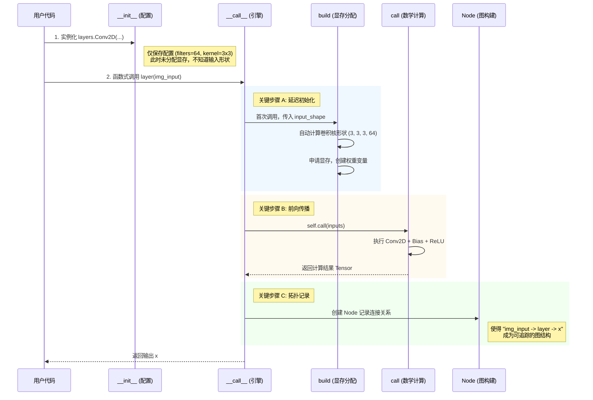
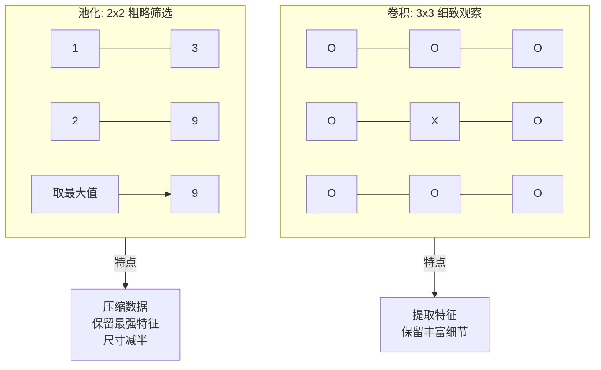
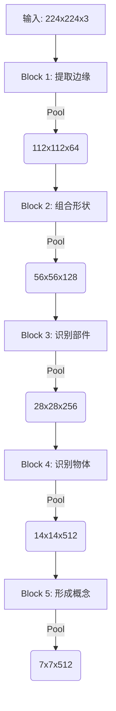
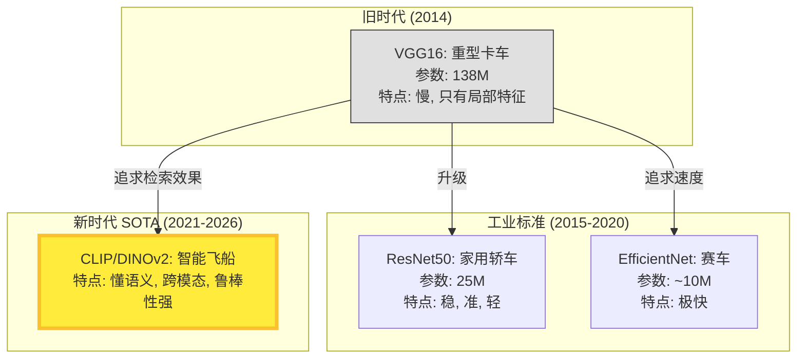

# VGG16 与深度学习深度解析：全过程记录

本文档详细记录了关于 VGG16 网络结构、Keras 框架机制以及深度学习核心概念的完整对话过程。涵盖了从代码底层实现到高层架构设计的深入探讨，包含详细的问答解析、思维过程、流程图和总结。

---

## 1. 代码底层机制：Keras 函数式 API 的奥秘

### ❓ 问题
代码 `x = layers.Conv2D(64, (3, 3), activation="relu", padding="same", name="block1_conv1")(img_input)` 中的 `(img_input)` 到底调用了哪个类的哪个方法？

### 💡 核心解答
*   **表面调用**: `keras.layers.Layer.__call__`
*   **实际执行**: `keras.layers.convolutional.BaseConv.call`

**思维过程解析**:
Python 的对象调用（加括号）触发 `__call__` 魔术方法。`Conv2D` 继承自 `BaseConv`，`BaseConv` 继承自 `Layer`。`__call__` 在基类 `Layer` 中实现，它作为模板方法处理通用逻辑，然后委托给 `call` 方法执行具体计算。

### 🔄 详细执行流程
这一行代码不仅是计算，更涉及 **延迟初始化 (Lazy Initialization)** 和 **图构建 (Graph Construction)**。



---

## 2. 层的微观视角：参数物理意义

### ❓ 问题
*   `Conv2D` 中的 `kernel_size=(3, 3)` 是什么意思？
*   `MaxPooling2D` 中的 `pool_size=(2, 2)` 和 `strides=(2, 2)` 是什么意思？

### 💡 核心解答

| 参数 | 类比 | 物理含义 | 作用 |
| :--- | :--- | :--- | :--- |
| **kernel_size=(3,3)** | **放大镜 / 视力范围** | 卷积核每次覆盖 3x3 的像素区域。 | **关注细节**。寻找局部特征（如线条、拐角）。 |
| **pool_size=(2,2)** | **筛子 / 筛选框** | 每次考察 2x2 的区域。 | **筛选特征**。在 4 个像素中只选最大的 1 个。 |
| **strides=(2,2)** | **步伐 / 跨度** | 窗口滑动的步幅。 | **降维**。步长=窗口大小意味着**无重叠**，直接导致输出尺寸减半。 |

### 🔄 操作对比图



---

## 3. 网络的宏观视角：VGG16 五层演变

### ❓ 问题
VGG16 的 5 个 Block 过程中，输入输出 `x` 发生了什么变化？

### 💡 核心解答
这是一个 **"空间换深度"** 的过程。图像越来越小（分辨率降低），但特征越来越厚（语义增强）。

| 阶段 | 结构 | 尺寸变化 | 深度变化 | 视觉含义 |
| :--- | :--- | :--- | :--- | :--- |
| **Input** | - | 224 x 224 | 3 | 原始 RGB 像素 |
| **Block 1** | 2 Conv + Pool | -> 112 x 112 | -> 64 | **边缘/纹理** (极细微线条) |
| **Block 2** | 2 Conv + Pool | -> 56 x 56 | -> 128 | **简单形状** (圆、方、条纹) |
| **Block 3** | 3 Conv + Pool | -> 28 x 28 | -> 256 | **物体部件** (眼睛、轮子) |
| **Block 4** | 3 Conv + Pool | -> 14 x 14 | -> 512 | **完整物体** (猫头、车身) |
| **Block 5** | 3 Conv + Pool | -> 7 x 7 | -> 512 | **抽象概念** (类别语义) |

### 🔄 演变流程



---

## 4. 深度概念辨析 (Q&A 精华)

### Q1: `(7, 7, 512)` 是什么意思？
*   **7x7 (Where)**: 将原图分成了 49 个区域。
*   **512 (What)**: 每个区域有 512 种特征描述。
*   总信息量：$7 \times 7 \times 512 = 25,088$ 个数值。

### Q2: 只有 512 维，能区分 1 万种分类吗？
**结论：完全没问题。**
*   **误区**: 认为 1 个维度对应 1 个分类。
*   **真相**: 512 维是**特征空间 (Feature Space)** 的坐标轴。
    *   状态空间大小为 $2^{512}$ (天文数字)。
    *   Milvus 通过计算向量距离来区分物体，理论上可以区分无限种类别，只要它们在特征空间中的坐标不同。

### Q3: 64个 Filters x 3x3 窗口扫描，计算量怎么算得过来？
**秘密武器：Im2Col + 矩阵乘法 (GEMM)**
*   GPU **不是** 用 `for` 循环逐个像素扫描的。
*   **优化过程**:
    1.  **Im2Col**: 将图片的所有局部 3x3 块“拉直”成一个巨大矩阵 $X$。
    2.  **Weights**: 将 64 个卷积核“拉直”成矩阵 $W$。
    3.  **GEMM**: 执行一次 $W \times X$，利用 GPU 并行能力瞬间算出 8.7 亿次乘法的结果。

### Q4: 这 64 个 Filters 到底提取了什么？
*   这不是人工设定的，是网络**自学习**的。
*   **可视化结果显示**:
    *   Filter 1-20: 各种角度的边缘（横、竖、斜）。
    *   Filter 21-40: 特定颜色的斑点。
    *   Filter 41-64: 复杂的纹理模式。

### Q5: 224x224x3 经过第一个 Conv2D 变成 224x224x64 吗？
**是的。**
*   **长宽不变 (224)**: 因为 `padding="same"` 补了零。
*   **深度变厚 (64)**: 因为用了 `filters=64`，将 3 通道映射到了 64 通道。

---

## 5. 展望：2026 年的 VGG16 替代方案

针对 **Pic Search (图像搜索)** 场景，VGG16 已显老态（重、慢、语义弱）。

### 🚀 SOTA 推荐 (效果最好)
*   **DINOv2 (Meta)**: 自监督学习的巅峰。不懂标签但懂物体关系，特征极其鲁棒。
*   **CLIP (OpenAI)**: 跨模态模型。支持 **"文字搜图"**，语义理解能力最强。

### 🛠 工程推荐 (平滑升级)
*   **ResNet50**: 工业界标准。精度高，权重小 (100MB vs VGG 500MB)。
*   **EfficientNetV2**: 速度极快，适合对延迟敏感的场景。

```mermaid
graph TD
    VGG[VGG16 (2014)]
    
    subgraph "更轻、更准"
    ResNet[ResNet50]
    end
    
    subgraph "极速"
    Eff[EfficientNet]
    end
    
    subgraph "更智能 (语义/跨模态)"
    CLIP[CLIP / DINOv2]
    end

    VGG -->|工程替换| ResNet
    VGG -->|移动端部署| Eff
    VGG -->|语义搜索升级| CLIP
```
针对图像搜索场景（Pic Search + Milvus），VGG16 虽然经典但确实已经过时（参数量大、速度慢、特征语义弱）。截止到 2026 年，以下是几类在性能和功能上全面超越 VGG16 的推荐模型：

### 1. 图像搜索领域的“SOTA” (强烈推荐)
对于以图搜图（Vector Search）场景，现代的**自监督学习**和**多模态**模型是降维打击般的存在。

| 模型名称 | 核心优势 | 为什么比 VGG 强 | 适用场景 |
| :--- | :--- | :--- | :--- |
| **DINOv2** (Meta) | **特征提取之王**。基于 ViT 的自监督学习模型。 | 不需要标签就能理解物体。它提取的特征对遮挡、光照、姿态变化有极强的鲁棒性，是目前公认做“以图搜图”效果最好的模型之一。 | **纯图像检索**、相似度比对。 |
| **CLIP** (OpenAI) | **图文双栖**。同时理解图片和文本语义。 | 把图片和文字映射到同一个空间。这让你不仅可以“以图搜图”，还能实现 **“文字搜图”**（如搜“草地上的红球”）。VGG 完全做不到这一点。 | **语义搜索**、跨模态检索。 |

### 2. 传统 CNN 的现代进化版 (平滑替换)
如果你希望代码改动最小（像使用 VGG 一样简单调用），以下模型是工业界的标准替代品：

| 模型名称 | 优势 | 相比 VGG16 |
| :--- | :--- | :--- |
| **ResNet50 / 101** | **工业标准**。引入残差连接 (Residual)。 | **精度更高，体积更小**（权重仅约 100MB，VGG 是 500MB+）。如果不想折腾新架构，选它最稳。 |
| **EfficientNetV2** | **效率之王**。Google 搜索出的最优架构。 | **速度极快，参数极少**。在移动端或对延迟敏感的场景下，它的性价比（精度/算力比）是无敌的。 |
| **ConvNeXt** | **现代卷积**。吸收了 Transformer 理念的 CNN。 | 它是卷积网络对 Transformer 的反击。保留了卷积的简单性，但在精度上可以对标 Swin Transformer。 |

### 3. Vision Transformer (ViT) 系列
目前的学术界性能天花板，基于 Attention 机制。

*   **ViT (Vision Transformer)**: 擅长捕捉全局关系（Global Context），不像 VGG 只能看局部。
*   **Swin Transformer**: 解决了 ViT 计算量大的问题，是目前计算机视觉任务中非常强大的骨干网络（Backbone）。

### 选型建议

针对你的 Milvus 图片搜索项目：

1.  **最推荐**: **CLIP** 或 **DINOv2**。因为它们生成的向量（Embedding）不仅包含视觉纹理，还包含丰富的**语义信息**。这会让搜索结果看起来更“聪明”。
2.  **最稳妥**: **ResNet50**。直接替换 VGG16，代码改动极小，性能立刻提升，模型文件变小 5 倍。

### 性能对比图示


这是一个非常经典的问题，触及了卷积神经网络（CNN）最核心的操作。

针对代码 `x = layers.Conv2D(64, (3, 3), activation="relu", padding="same", name="block1_conv1")(img_input)`，当输入一张 **224x224x3** 的图片时，我们将运算过程和输出结果解析如下：

### 1. 结论先行：输出结果是什么？

*   **输入数据形态：** `(224, 224, 3)` (高度, 宽度, RGB通道数)
*   **输出数据形态：** `(224, 224, 64)` (高度, 宽度, 特征图数量)
*   **数据变化：** 图片的空间尺寸（长宽）没变，但“厚度”（深度/通道数）从 3 变成了 64。

---

### 2. 详细运算过程解析

这个过程实际上包含三个子步骤：**填充 (Padding)** -> **卷积 (Convolution)** -> **激活 (Activation)**。

#### 第一步：填充 (Padding="same")
为了保证输出的长宽和输入一样（保持 224x224），Keras 会自动在原图周围进行填充。
*   **原因：** 卷积核大小是 3x3。如果不填充，边缘的像素无法作为中心点被卷积，图像会变小（变成 222x222）。
*   **操作：** 在 224x224 的图像外围补一圈 0（Zero Padding），实际上图像变成了 **226x226x3** 的临时矩阵。

#### 第二步：卷积 (Convolution)
这是最复杂的数学部分。
*   **卷积核 (Kernel/Filter)：**
    *   代码中定义了 `64` 个卷积核。
    *   每个卷积核的空间大小是 `(3, 3)`。
    *   **关键点：** 卷积核的深度会自动匹配输入的深度。因为输入是 RGB 图片（深度 3），所以**每一个**卷积核的实际参数形状是 **3x3x3**（高x宽x输入通道）。
*   **滑动计算：**
    *   这 64 个卷积核就像 64 个不同的“滤镜”。
    *   每一个卷积核会在 226x226（填充后）的图像上滑动（步长 stride 默认是 1）。
    *   **点积运算：** 在每一个位置，卷积核的 27 个数值 (3x3x3) 与图像对应位置的 27 个像素值进行**元素相乘并求和**，最后加上一个**偏置值 (Bias)**。
    *   **结果：** 每一个卷积核滑动完一遍，会产生一个 224x224 的二维矩阵（Feature Map）。
*   **堆叠：**
    *   因为有 64 个卷积核，所以会产生 64 个 224x224 的矩阵。
    *   将它们在深度方向堆叠，得到 `(224, 224, 64)` 的张量。

#### 第三步：激活 (Activation="relu")
卷积是线性运算，神经网络需要非线性能力。
*   **操作：** 对上一步得到的 `(224, 224, 64)` 张量中的**每一个数值**应用 ReLU 函数。
*   **公式：** $f(x) = max(0, x)$
*   **效果：** 所有负数都变成 0，正数保持不变。这一步不会改变数据的形状，依然是 `(224, 224, 64)`。

---

### 3. 可视化流程图

```mermaid
graph LR
    subgraph Input
    A[输入图片<br/>224 x 224 x 3]
    end

    subgraph Operation["层运算: block1_conv1"]
    direction TB
    B[Padding<br/>周围补0<br/>变成 226 x 226 x 3]
    C[卷积运算<br/>64个过滤器 (3x3x3)<br/>每个过滤器输出一张特征图]
    D[ReLU激活<br/>将所有负值置为0]
    
    B --> C --> D
    end

    subgraph Output
    E[输出张量<br/>224 x 224 x 64]
    end

    A --> B
    D --> E

    style A fill:#e1f5fe,stroke:#01579b
    style E fill:#e8f5e9,stroke:#2e7d32
    style C fill:#fff3e0,stroke:#ff6f00
```

### 4. 数据层面的微观视角

如果我们聚焦到输出结果 `(224, 224, 64)` 中坐标为 `(0, 0, 0)` 的**那一个数值**，它是怎么算出来的？

1.  **取样：** 选取输入图片左上角（包含Padding）的 3x3 区域，这是一块 3x3x3 的数据块（27个像素值）。
2.  **权重：** 拿出第 1 个卷积核的权重，也是 3x3x3 的数据块（27个参数）。
3.  **相乘求和：**
    $$ \text{Value} = \sum (Input_{pixel} \times Weight_{kernel}) + Bias_1 $$
    即：(像素1×权重1) + ... + (像素27×权重27) + 偏置1
4.  **ReLU：**
    $$ \text{Final\_Output} = max(0, \text{Value}) $$

### 5. 补充：参数量

*   **权重参数 (Weights)：** $3 \times 3 \times 3 \times 64 = 1,728$ 个参数。
*   **偏置参数 (Biases)：** $64$ 个参数（每个卷积核配一个偏置）。
*   **该层总参数量：** $1,792$ 个可训练参数。

这是一个非常棒的思维转折点！你的理解离真相只有一步之遥了。

你说的完全正确：**对于输入数据来说，所有卷积核“看到”的东西确实是完全一样的。**

但是，**“看到相同的数据”** 不等于 **“计算出相同的结果”**。

这就像 **64 个戴着不同颜色眼镜的人**（64个卷积核）在看 **同一幅画**（输入图像）。
*   戴红眼镜的人只能看到红色的部分。
*   戴蓝眼镜的人只能看到蓝色的部分。
*   戴墨镜的人只能看到轮廓。
虽然他们看的是完全一样的东西，但他们脑子里得到的反馈（输出特征）是完全不同的。

下面我用数学和图示来彻底解开这个疑惑：

### 1. 核心公式：结果 = 输入 × 权重

卷积的核心操作是 **点积（Dot Product）**。

$$ 输出 = (输入像素 \times 卷积核权重) 的总和 $$

*   **输入像素 ($I$)**：对于所有 64 个核，这个 $I$ 确实是**一模一样**的（比如你说的那个 3x3x3 的局部块）。
*   **卷积核权重 ($W$)**：这是关键！这 64 个核内部的数值（权重）是**互不相同**的。

### 2. 数值举例（为了简化，假设是 1x1 的区域）

假设输入图像在某个位置的像素值是：**[10, 10, 10]** (代表一个灰度值或者 RGB 值)。

现在有两个卷积核来“看”这个位置：

*   **卷积核 A (专门找亮度的)**
    *   它的权重可能是：**[0.5, 0.5, 0.5]**
    *   计算：$10*0.5 + 10*0.5 + 10*0.5 = 15$
    *   **结果 A：15**

*   **卷积核 B (专门找边缘差值的)**
    *   它的权重可能是：**[-1, 0, 1]** (这种权重设计用来寻找变化)
    *   计算：$10*(-1) + 10*0 + 10*1 = 0$
    *   **结果 B：0**

**结论：** 虽然输入都是 **[10, 10, 10]**，但因为 A 和 B 的**权重不同**，A 输出了强烈的信号 (15)，而 B 认为这里毫无价值 (0)。

### 3. 为什么 64 个核的权重会不同？

你可能会问：“凭什么它们就不同呢？”

1.  **随机初始化（出生就不同）：** 在网络刚开始训练前，程序会用随机数生成器给这 64 个核赋予完全随机的初始值。所以一开始，它们每一个都是独一无二的“乱码”。
2.  **梯度下降（成长也不同）：** 在训练过程中，神经网络会发现：“哎，第 1 个核用来识别**竖线**能降低错误率，第 2 个核用来识别**圆圈**能降低错误率”。算法会自动强迫它们向着不同的方向进化，以此来提取尽可能丰富的特征。

### 4. 流程图解

```mermaid
graph LR
    subgraph Input_Data [输入数据 (完全相同)]
    Pixel[3x3x3 像素块<br>例如: 左上角的树叶]
    end

    subgraph Kernel_1 [卷积核 1: 寻找边缘]
    W1[权重 W1<br>[-1, -1, ...]]
    Calc1[计算: 像素 x W1]
    Out1[输出: 0.8<br>(发现了边缘)]
    end

    subgraph Kernel_2 [卷积核 2: 寻找绿色]
    W2[权重 W2<br>[0, 1, 0...]]
    Calc2[计算: 像素 x W2]
    Out2[输出: 0.1<br>(没发现绿色)]
    end

    Pixel --> Calc1
    W1 --> Calc1 --> Out1

    Pixel --> Calc2
    W2 --> Calc2 --> Out2

    style Input_Data fill:#f9f,stroke:#333
    style Out1 fill:#bbf,stroke:#333
    style Out2 fill:#bfb,stroke:#333
```

### 总结

*   **读取的数据：** 是**一样**的（都是那 27 个像素值）。
*   **计算的方式：** 是**不一样**的（因为乘以了不同的权重矩阵）。
*   **目的：** 我们就是故意要用 64 组不同的“筛子”去筛同一堆沙子，有的筛子留下金子，有的筛子留下钻石，有的留下石头。如果大家都一样，那就没必要设 64 个核了，设 1 个就够了。